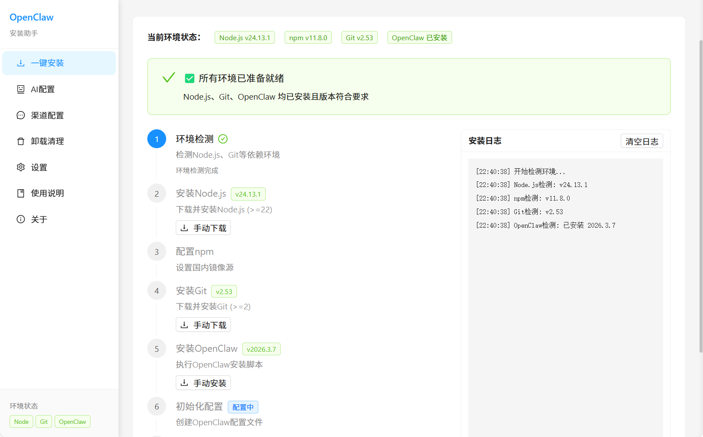

# OpenClaw 安装助手

一个面向 Windows 的桌面安装与配置工具，帮助用户尽量少碰命令行，完成 OpenClaw 的环境检查、依赖安装、AI 配置、渠道配置、诊断与卸载。

## 功能亮点

- 一键安装：自动检查并安装 OpenClaw 运行所需环境
- 环境检测：检查 Node.js、npm、Git、OpenClaw 等关键状态
- AI 配置：支持火山引擎、Kimi 等 AI 能力接入配置
- 渠道配置：支持飞书、QQ 等渠道接入信息填写与引导
- 可视化日志：安装、配置、诊断过程都有实时日志反馈
- 问题诊断：提供排查入口，方便定位安装或配置异常
- 完整卸载：支持对 OpenClaw 进行清理和卸载




## 技术栈

- Electron
- React 19
- TypeScript
- Vite
- Ant Design
- Zustand
- Vitest
- Playwright

## 运行环境

- Windows 10 / 11
- Node.js 20 及以上
- npm
- Git
- 建议使用管理员权限运行

## 快速开始

```bash
# 安装依赖
npm install

# 启动前端开发服务器
npm run dev

# 启动 Electron 开发模式
npm run dev:electron
```

## 常用命令

```bash
# 前端开发
npm run dev

# Electron 开发
npm run dev:electron

# 生产构建
npm run build

# 打包 Windows 安装程序
npm run electron:build

# 单元测试
npm run test:unit

# 集成测试
npm run test:integration

# E2E 测试
npm run test:e2e

# 一次性跑完整测试
npm run test:all
```

## 使用流程

1. 安装页：检测环境并执行一键安装
2. AI 配置页：选择模型提供商并填写 API 配置
3. 渠道配置页：完成飞书、QQ 等渠道接入设置
4. 诊断页：查看问题检查结果与日志
5. 卸载页：执行 OpenClaw 卸载与清理
6. 设置 / 关于页：查看项目说明与补充信息

## 项目结构

```text
openclaw-install/
├─ electron/      # Electron 主进程、预加载脚本、IPC 处理
├─ src/           # React 页面、组件、状态管理
├─ docs/          # 用户文档与技术文档
├─ public/        # 静态资源
├─ scripts/       # GitHub 推送与发布脚本
├─ tests/         # 单元、集成、E2E 测试
├─ DEVELOPMENT.md # 开发说明
└─ package.json
```

## 文档

- 用户指南：`docs/user-guide.md`
- 技术说明：`docs/technical-guide.md`
- 开发说明：`DEVELOPMENT.md`

## 发布到 GitHub

### 仅推送代码

如果你已经在本地完成 Git 配置，并且远程仓库 `origin` 已存在，推荐直接使用 Git 命令推送：

```bash
git add .
git commit -m "chore: prepare GitHub repo"
git push -u origin main
```

这是最稳妥的方式，也最适合你当前“已经登录 Git”的场景。

### 使用脚本推送

如果你希望脚本自动检查仓库、自动补 `origin`，或者后续还要接 GitHub Release，可以使用：

```powershell
.\scripts\upload-to-github.ps1
```

说明：

- 适合 Windows PowerShell
- 脚本会检测 `git` 和 `gh`
- 如果没有远程仓库，会尝试帮你创建或绑定 GitHub 仓库

### 创建 Release

```powershell
.\scripts\upload-to-github.ps1 -CreateRelease
```

或者：

```bash
npm run github:release
```

执行后会先打包应用，再从 `release-build/` 中查找 `.exe` 安装包并创建 GitHub Release。

## 注意事项

- 首次安装或写入系统目录时，建议以管理员权限运行
- 打包输出目录为 `release-build/`
- 本地调试目录、测试报告、构建产物已通过 `.gitignore` 排除
- 如果只是上传源码，不需要先执行打包

## 作者

**振振公子** - [@henryczq](https://github.com/henryczq)

## 相关链接

- GitHub：<https://github.com/henryczq/openclaw-install>
- Issues：<https://github.com/henryczq/openclaw-install/issues>

## License

MIT
