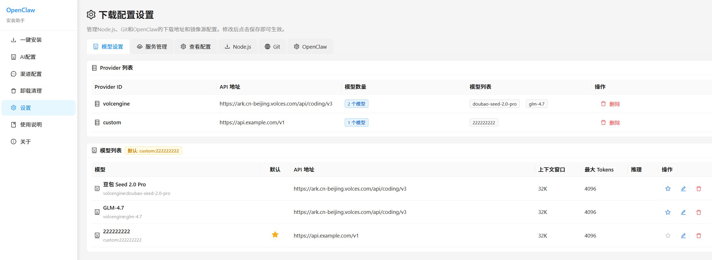
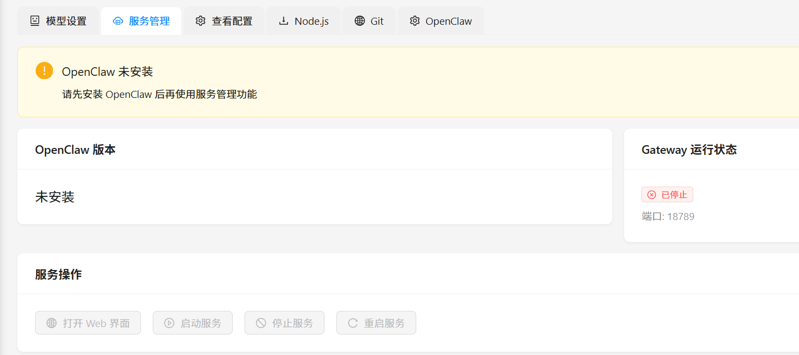
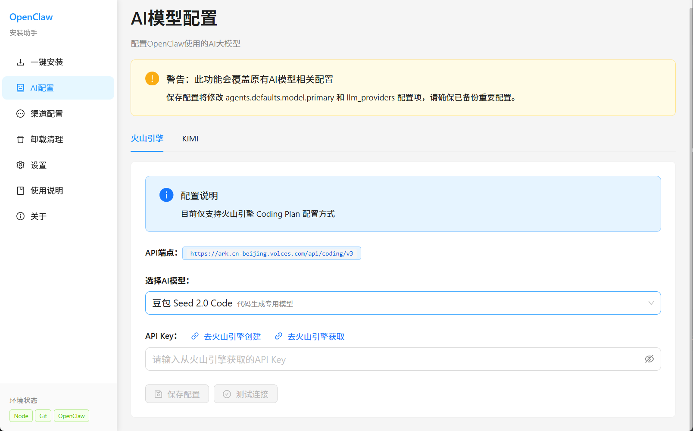
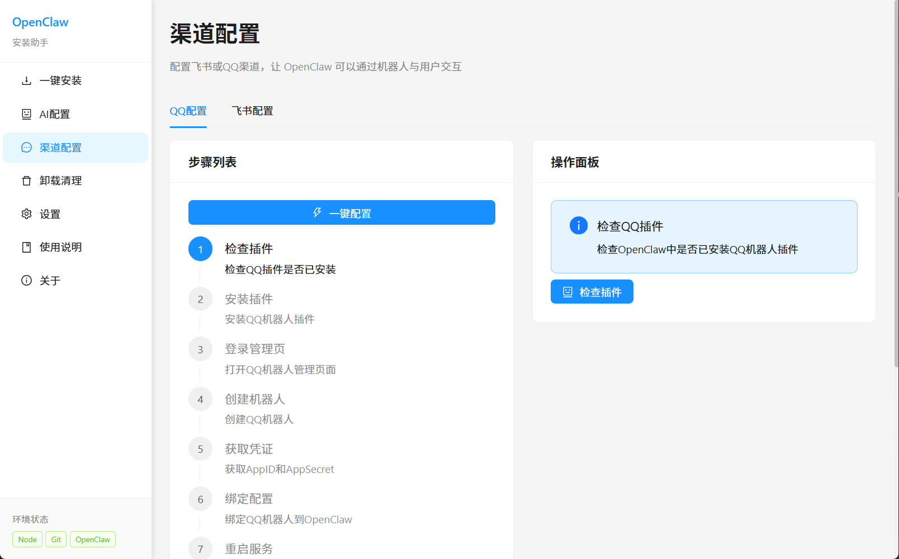

# OpenClaw 安装助手

一个面向 Windows 的openclaw桌面安装与配置工具，帮助用户尽量少碰命令行，完成 OpenClaw 的环境检查、依赖安装、AI 配置、渠道配置等。

帮组不会安装的用户便捷进行openclaw的安装与配置

## 功能亮点

- 一键安装：自动检查并安装 OpenClaw 运行所需环境，检查 Node.js、npm、Git、OpenClaw 等关键状态
- AI 配置：支持火山引擎、Kimi 等 AI 能力接入配置
- 渠道配置：支持飞书、QQ 等渠道接入信息填写与引导


### 2026.03.11 新增功能
新增模型读取和配置功能，用户可以在程序中直接读取和配置AI模型，而不需要手动修改配置文件。


新增服务管理功能，用户可以在程序中直接启动、停止、重启OpenClaw服务，而不需要手动操作命令行。


### 2026.03.10 功能：




## 注意

务必以管理员方式运行程序，否则安装openclaw可能出错

## 说明

测试通过环境：
系统：windows 11
AI模型：当前支持火山引擎、Kimi
渠道配置：仅支持QQ
持续完善中

## 场景问题
1.nodejs和git安装后需要重启后才能识别到，大家可以手动重启
2.系统还不够智能，配置AI模型中如果遇到什么问题，大家可以分两步走：先登录，再点击相关配置
3.如果使用中，有其它问题请留言


## 技术栈

- Electron
- React 19
- TypeScript
- Vite
- Ant Design
- Zustand
- Vitest
- Playwright

## 运行环境

- Windows 10 / 11
- Node.js 20 及以上
- npm
- Git
- 建议使用管理员权限运行

## 快速开始

```bash
# 安装依赖
npm install

# 启动前端开发服务器
npm run dev

# 启动 Electron 开发模式
npm run dev:electron
```


## 项目结构

```text
openclaw-install/
├─ electron/      # Electron 主进程、预加载脚本、IPC 处理
├─ src/           # React 页面、组件、状态管理
├─ docs/          # 用户文档与技术文档
├─ public/        # 静态资源
├─ scripts/       # GitHub 推送与发布脚本
├─ tests/         # 单元、集成、E2E 测试
├─ DEVELOPMENT.md # 开发说明
└─ package.json
```


## 作者

**振振公子** - [@henryczq](https://github.com/henryczq)

## 相关链接

- GitHub：<https://github.com/henryczq/openclaw-install>
- Issues：<https://github.com/henryczq/openclaw-install/issues>

